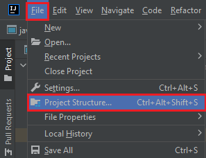
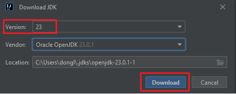
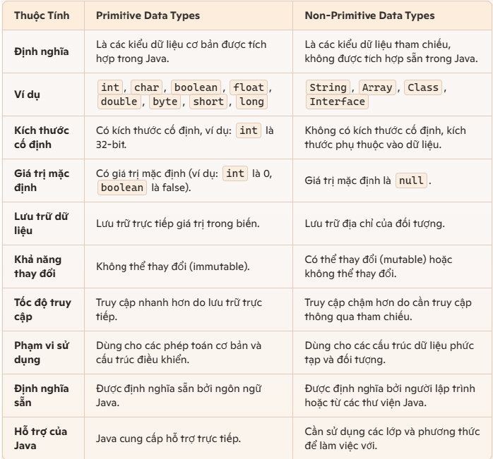
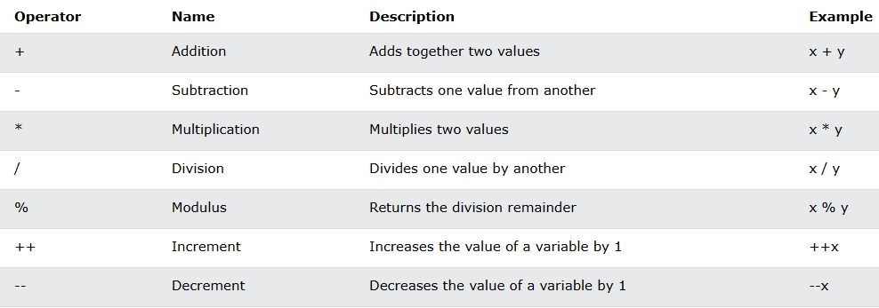
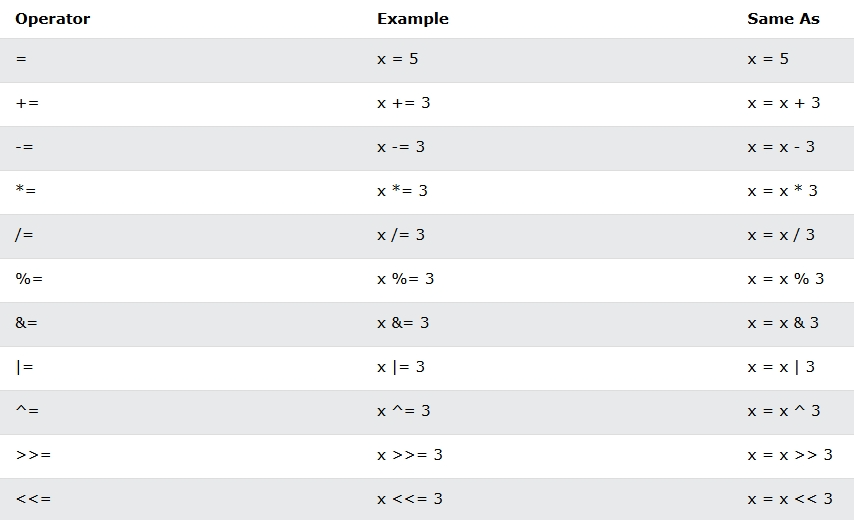
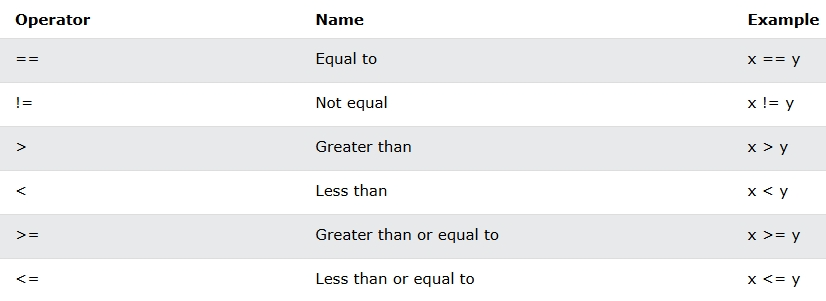
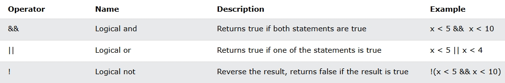
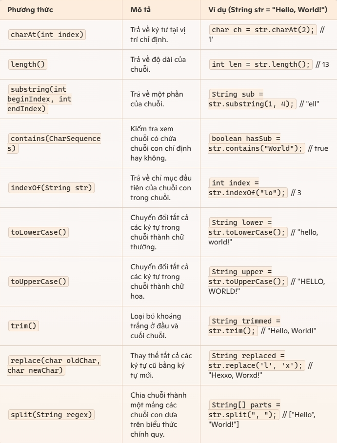

# Làm quen: Why && how

## History
- **What is Java?** 
  - Java là một ngôn ngữ lập trình hướng đối tượng, được thiết kế để có thể chạy trên nhiều nền tảng khác nhau.
  - Ước tính có hơn 3 tỉ thiết bị chạy Java
  - Java được dùng cho:
      - Mobile applications (Android)
      - Desktop applications
      - Web applications
      - Web servers and application servers
      - Games
      - Database connection
      - And much, much more!
- **Viết ra bởi ai?**
  - Được phát triển bởi Sun Microsystems (accquired by Oracle Corporation - 2010), đặc biệt là bởi James Gosling và đội ngũ của ông vào những năm 1990. First release 1995
- **Tại sao dùng Java trong thời điểm ấy? Java giải quyết bài toán gì?**
  - Java được thiết kế để giải quyết vấn đề về tính tương thích(compatibility) và khả năng di động(portability) của phần mềm. Bằng cách sử dụng mô hình "viết một lần, chạy mọi nơi" (Write Once, Run Anywhere), Java giúp các nhà phát triển có thể viết mã một lần và chạy trên bất kỳ nền tảng nào hỗ trợ Java mà không cần sửa đổi nhiều.
- **Why Java?**
  - Chạy được trên nhiều platforms: Windows, Mac, Linux, Raspberry Pi, etc.
  - Nhiều job
  - Dễ học và lập trình
  - Open-source and miễn phí
  - Secure, fast and powerful
  - Cộng đồng support rất lớn
  - OOP: clear structure; code dùng lại được; giảm chi phí phát triển
- **Java version history**
  - Java SE 23 is the latest version (released 17/9/2024)
  - Long-term support (LTS) versions: 21, 17, 11 and 8 - Will receive Oracle Premier Support
  https://en.wikipedia.org/wiki/Java_version_history
  - **Rankings 2024**
  https://www.techrepublic.com/article/tiobe-index-language-rankings/?form=MG0AV3
    

## Các thành phần cơ bản của Java
- **JDK (Java Development Kit):**
  - Bộ công cụ phát triển cho developer, bao gồm:
    - compiler(trình biên dịch): java source code -> bytecode
    - JRE (included in JDK): JVM, core libraries
  - Usage: developing/compiling/running
- **JRE (Java Runtime Environment):**
  - Môi trường chạy cho các chương trình Java, bao gồm:
    - Java Virtual Machine (JVM): Interprets and executes Java bytecode
    - các thư viện cần thiết để chạy các ứng dụng được phát triển bằng Java.
  - Usage: require for run application

## Start
### IDE
- Có nhiều loại IDE: IntelliJ, Eclipse, Netbean, VSCode, Vim ...
- Khuyên dùng: IntelliJ. Nhu cầu cơ bản thì bản Community là đủ

### Java install
- Dùng luôn IntelliJ để install Java
- Các bước:
  - 
  - 
  - 

### Hello world
- **Bước 1:** Tạo một Java file và đặt tên là `HelloWorld.java`.
- **Bước 2:** Viết Java source code cơ bản:
  ```java
  public class HelloWorld {
      public static void main(String[] args) {
          System.out.println("Hello, World!");
      }
  }

# Hướng dẫn tạo tài khoản GitHub và đẩy code lên GitHub (Maybe reuse)

## Bước 1: Tạo tài khoản GitHub
1. Truy cập trang web [github.com](https://github.com) và nhấn vào nút **Sign up**.
2. Nhập thông tin cá nhân của bạn bao gồm địa chỉ email, mật khẩu, và tên người dùng. 
3. Xác nhận email của bạn thông qua email mà GitHub gửi đến.
4. Hoàn thành các bước hướng dẫn còn lại để thiết lập tài khoản của bạn.
5. upload ssh key

## Bước 2: Thiết lập Git trên máy tính
1. Tải và cài đặt Git từ trang web [git-scm.com](https://git-scm.com).
2. Sau khi cài đặt, mở terminal (hoặc Command Prompt trên Windows).
3. Cấu hình thông tin người dùng của bạn:
   ```bash
   git config --global user.name "Tên của bạn"
   git config --global user.email "email@example.com"

git init
git add .
git commit -m "First commit"
git remote add origin <repository-url>
git push -u origin master


# Cú pháp cơ bản

## Java Output
- Java supports some methods to output values
```java
System.out.println("Hello World!"); // print with new line
System.out.print("Hello World!"); // print without new line
System.out.print(2024); // print 2024
```

## Java comment
- explain code, more readable
- prevent some code run when testing/debugging
- // for short comments, and /* */ for longer.
- java doc
```java
System.out.println("Hello World!"); // This is a single-line comment
/* This is a 
long comment
*/
System.out.println("Hello World!");

/**
 * Calculates the sum of two integers.
 * 
 * @param a The first integer.
 * @param b The second integer.
 * @return The sum of the two integers.
 */
public static int sum(int a, int b) {
    return a + b;
}


```

## Biến, hằng, các kiểu dữ liệu
- **Biến:** Dùng để lưu trữ giá trị, có thể thay đổi trong quá trình thực thi (execution) chương trình.
  - Cú pháp khai báo biến: `int age = 10;`
  - rules:
      - can contain letters, digits, underscores, and dollar signs
      - must begin with a letter or $ _
      - should start with a lowercase letter, and cannot contain whitespace
      - are case-sensitive ("myVar" vs. "myvar")
      - NOT Java keywords, e.g. boolean
- **Hằng:** Giá trị cố định không thay đổi.
  - Cú pháp khai báo hằng: `final int MAX = 100;`
- **Các kiểu dữ liệu:**
  - **Integer:** `int`, `byte`, `short`, `long`
  - **Floating-point numbers:** `float`, `double`
  - **Character:** `char`
  - **Boolean:** `boolean` (true/false)
  - **String:** `String`
  - **Ví dụ:**
    ```java
    class Person {
        int age = 25;
        float height = 5.8f;
        char gender = 'M';
        boolean isStudent = true;
        String name = "John";
        System.out.println("Hello " + name); // display name variable
    }
    ```
- **Primitive Data vs. Non-Primitive Data Types:**
- 
- **Type Casting:** Chuyển đổi 1 kiểu dữ liệu này sang kiểu khác
  - **Widening casting (automatically):** Chuyển từ kiểu dự liệu nhỏ sang lớn, không bị mất dữ liệu.
    - byte -> short -> char -> int -> long -> float -> double
  - **Narrowing Casting (manually):** Chuyển từ kiểu dữ liệu lớn sang nhỏ, cần xác minh cẩn thận
    - double -> float -> long -> int -> char -> short -> byte
  ```java
  int intValue = 100;
  long longValue = intValue; // Implicit casting từ int sang long -> result: 100

  double doubleValue = 9.78;
  int intValue = (int) doubleValue; // Explicit casting từ double sang int -> result: 9
  ```


## Các toán tử
- **Arithmetic Operators(Số học):**
  - 
- **Assignment Operators (Phép gán):**
  - 
- **Comparison Operators (Phép so sánh):**
  - 
- **Comparison Operators (Phép so sánh):**
  - 
- **Ví dụ:**
  ```java
  int x = 10;
  int y = 20;
  int sum = x + y; // 30
  int difference = x - y; // -10
  int product = x * y; // 200
  int quotient = x / y; // 0
  int remainder = x % y; // 10
  boolean result = (x < y) && (x > 5); // true
  x++; // 11
  y--; // 19

## String
- Dùng để lưu trữ text
### String methods
  - 
### Kết hợp String
  - Toán tử +
  - concat() method
  - StringBuilder hoặc StringBuffer
  ```java
  String str1 = "Hello";
  String str2 = "World";
  // 3 cách đều ra kết quả: "Hello, World!"
  String result1 = str1 + ", " + str2 + "!";
  String result2 = str1.concat(", ").concat(str2).concat("!");
  StringBuilder sb = new StringBuilder();
  sb.append("Hello");
  sb.append(", ");
  sb.append("World");
  sb.append("!");
  String result3 = sb.toString();
  ```
  - Nên dùng cách nào?
    - toán tử + và concat() method: Đơn giản, dễ đọc, nhưng hiệu suất kém vì tạo ra String object mới mỗi lần kết hợp String
    - StringBuilder (không đồng bộ)/StringBuffer (đồng bộ): Hiệu suất tốt hơn

# Kiểu dữ liệu nâng cao

## Mảng
- **Mảng (Array):**
  - Mảng là cấu trúc dữ liệu lưu trữ nhiều giá trị có cùng kiểu dữ liệu.
  - Các phần tử trong mảng được lưu trữ liên tiếp nhau trong bộ nhớ.
  - Cú pháp khai báo và truy cập mảng:
    ```java
    class ArraySample {
        int[] arr = new int[10]; // Khai báo mảng kiểu int với 10 phần tử
        int[] numbers = {1, 2, 3, 4, 5}; // Khởi tạo mảng với các giá trị ban đầu
        int firstElement = numbers[0]; // Truy cập phần tử đầu tiên
        numbers[2] = 10; // Gán giá trị cho phần tử thứ 3
    }
    ```
## Đối tượng
- **Đối tượng (Object):**
  - Đối tượng là thực thể có trạng thái và hành vi.
  - Được tạo từ class (class), chứa các thuộc tính (attributes) và phương thức (methods).
    - Attribute (field/propety): variable chứa data của object
    - Method: functions định nghĩa trong class -> behaviors or actions của object.
    - Constructor: 
      - special method được gọi khi object khởi tạo.
      - purpose: initialize newly object's attributes
  - Ví dụ về class và object:
    ```java
    // Định nghĩa class
    public class Person {
        String name;
        int age;

        // Constructor
        public Person(String name, int age) {
            this.name = name;
            this.age = age;
        }

        // Method hiển thị thông tin
        public void display() {
            System.out.println("Name: " + name);
            System.out.println("Age: " + age);
        }
    }

    // Tạo object
    Person person = new Person("Alice", 30);
    person.display(); // Gọi method của object
    ```

## Map và HashMap
- **Map:**
  - Map (interface) là cấu trúc dữ liệu lưu trữ các cặp key-value.
  - Cho phép truy cập nhanh chóng đến giá trị thông qua key.
- **HashMap:**
  - HashMap (class) Là một implementation (triển khai) của Map, lưu trữ các cặp key-value.
  - Các key trong HashMap là duy nhất và không theo thứ tự.
  - Cú pháp sử dụng HashMap:
    ```java
    import java.util.HashMap;
    class HashMapSample {
      HashMap<String, Integer> map = new HashMap<>();
      map.put("apple", 10);
      map.put("banana", 20);

      int value = map.get("apple"); // Truy cập giá trị thông qua key
      System.out.println("Value of apple: " + value);
    }
    ```

## ArrayList và List
- **List:**
  - List là một interface trong Java, đại diện cho một danh sách các phần tử.
  - Cú pháp sử dụng List:
    ```java
    import java.util.List;
    import java.util.ArrayList;

    List<String> languages = new ArrayList<>();
    languages.add("Java");
    languages.add("Python");
    languages.add("C++");

    for (String lang : languages) {
        System.out.println(lang);
    }
    ```
  
- **ArrayList:**
  - ArrayList là một implementation của List.
  - ArrayList là một danh sách động, cho phép lưu trữ các phần tử và tự động mở rộng kích thước khi cần.
  - Cú pháp sử dụng ArrayList:
    ```java
    import java.util.ArrayList;

    ArrayList<String> list = new ArrayList<>();
    list.add("Java");
    list.add("Python");
    list.add("C++");

    String language = list.get(1); // Truy cập phần tử thứ 2
    System.out.println("Language at index 1: " + language);
    ```
# Try, catch, exception handling

## Xử lý exception (ngoại lệ) trong Java
- **Exception:**
  - Là các sự cố phát sinh trong quá trình thực thi chương trình, gây ra việc dừng hoạt động của chương trình nếu không được xử lý.
  - Ví dụ: Chia một số cho 0, truy cập một phần tử không tồn tại trong mảng.

- **Các loại exception thông dụng:**
  - ArithmeticException: Exception số học (vd: chia cho 0)
  - NullPointerException: Exception con trỏ null (vd: truy cập phương thức của một đối tượng null)
  - ArrayIndexOutOfBoundsException: Exception truy cập index ngoài giới hạn của mảng
  - FileNotFoundException: Exception file không tìm thấy
  - IOException: Exception vào/ra

- **Lợi ích của việc xử lý exception:**
  - Giúp chương trình hoạt động ổn định và không bị dừng đột ngột khi gặp lỗi.
  - Tăng cường khả năng maintain và đọc hiểu source code.
  - Giúp phát hiện và khắc phục lỗi một cách dễ dàng và rõ ràng hơn.

## Try, catch, finally
- **Try:** Block of code để thử thực hiện và có thể phát sinh exception
- **Catch:** Block of code để xử lý exception nếu nó phát sinh trong try.
- **Finally:** Block of code sẽ luôn được execute dù có hay không có exception phát sinh.


## Cú pháp xử lý exception
```java
try {
    // Code có thể gây ra exception
} catch (ExceptionType e) {
    // Code xử lý exception
} finally {
    // Code luôn được thực thi
}

public class ExceptionExample {
    public static void main(String[] args) {
        try {
            int result = 10 / 0; // Gây ra exception ArithmeticException
        } catch (ArithmeticException e) {
            System.out.println("Cannot divide by zero."); // Xử lý exception
        } finally {
            System.out.println("This block is always executed."); // Khối finally
        }
    }
}
```

# Date time

## Sử dụng class `Date` trong Java
- **class `Date`:** class này đại diện cho một điểm thời gian cụ thể, chính xác đến mili giây kể từ mốc thời gian (epoch) là 00:00:00 ngày 1 tháng 1 năm 1970.
- **Example:**
  ```java
  import java.util.Date;

  public class DateExample {
      public static void main(String[] args) {
          Date currentDate = new Date();
          System.out.println("Current date: " + currentDate);  // Current date: Sat Dec 07 08:25:45 ICT 2024
      }
  }

## Sử dụng class `Calendar` trong Java
- **class `Calendar`:** Cung cấp các method xử lý date
- **Example:**
  ```java
  import java.util.Calendar;

  public class CalendarExample {
    public static void main(String[] args) {
        Calendar calendar = Calendar.getInstance();
        System.out.println("Current date: " + calendar.getTime()); // Current date: Sat Dec 07 08:25:45 ICT 2024

        // Getting detailed date information
        int year = calendar.get(Calendar.YEAR);
        int month = calendar.get(Calendar.MONTH); // Months are 0-based
        int day = calendar.get(Calendar.DAY_OF_MONTH);
        System.out.println("Year: " + year);
        System.out.println("Month: " + (month + 1)); // Correcting for 0-based month
        System.out.println("Day: " + day);
    }
  }

## Sử dụng class `java.time(Java 8 and later)` trong Java
- **Purpose:** Modern date and time API, introduced in Java 8.
- **Key classes:**
  - LocalDate: Represents a date (year, month, day) without time.
  - LocalTime: Represents a time (hours, minutes, seconds) without date.
  - LocalDateTime: Combines date and time.
  - ZonedDateTime: Combines date and time with time zone information.
- **Example:**
  ```java
  import java.time.LocalDate;
  import java.time.LocalTime;
  import java.time.LocalDateTime;
  import java.time.ZonedDateTime;

  public class DateTimeExample {
    public static void main(String[] args) {
      // LocalDate example
      LocalDate date = LocalDate.now();
      System.out.println("Current date: " + date); // Current date: 2024-12-07

      // LocalTime example
      LocalTime time = LocalTime.now();
      System.out.println("Current time: " + time); // Current time: 09:11:12.823263400

      // LocalDateTime example
      LocalDateTime dateTime = LocalDateTime.now();
      System.out.println("Current date and time: " + dateTime); // Current date and time: 2024-12-07T09:11:12.823263400

      // ZonedDateTime example
      ZonedDateTime zonedDateTime = ZonedDateTime.now();
      System.out.println("Current date/time with timezone: " + zonedDateTime); // Current date/time with timezone: 2024-12-07T09:11:12.824262+07:00[Asia/Saigon]
    }
  }


# Advanced Syntax: Conditions, Loops

## Conditions
- **If-Else:** Thực thi code với điều kiện cụ thể
  ```java
  int number = 10;
  if (number > 0) {
      System.out.println("Number is positive");
  } else if (number < 0) {
      System.out.println("Number is negative");
  } else {
      System.out.println("Number is zero");
  }
  ```

- **Switch:** Thực thi code với nhiều lựa chọn.
```java
int day = 3;
switch (day) {
    case 1:
        System.out.println("Monday");
        break;
    case 2:
        System.out.println("Tuesday");
        break;
    case 3:
        System.out.println("Wednesday");
        break;
    default:
        System.out.println("Invalid day");
        break;
}
```

## Loops
- **For:** Lặp lại một khối lệnh với số lần xác định trước, dựa trên biểu thức khởi tạo, điều kiện và biểu thức cập nhật
```java
for (int i = 1; i <= 5; i++) {
    System.out.print(i + " ");
}
// Kết quả: 1 2 3 4 5
```

- **For-each**: Duyệt qua các phần tử trong collection
```java
int[] numbers = {1, 2, 3, 4, 5};
for (int num : numbers) {
    System.out.println(num + " ");
}
// Kết quả: 1 2 3 4 5
```
- **While:** Lặp lại code khi điều kiện vẫn đúng
```java
int i = 1;
while (i <= 5) {
    System.out.print(i + " ");
    i++;
}
// Kết quả: 1 2 3 4 5
```

- **Do-While:** Tương tự như vòng lặp while, nhưng code được thực hiện ít nhất một lần trước khi kiểm tra điều kiện.
```java
int i = 1;
while (i <= 5) {
    System.out.print(i + " ");
    i++;
}
// Kết quả: 1 2 3 4 5
```

- **Break/Continue:** Điều khiển luồng thực thi: Thoát khỏi vòng lặp(break) hoặc bỏ qua các lần lặp (continue)
```java
for (int i = 1; i < 10; i++) {
    if (i == 5) {
        break;
    }
    System.out.print(i + " ");
}
// Kết quả: 1 2 3 4

for (int i = 1; i < 10; i++) {
    if (i == 5) {
        continue;
    }
    System.out.print(i + " ");
}
// Kết quả: 1 2 3 4 6 7 8 9 
```


